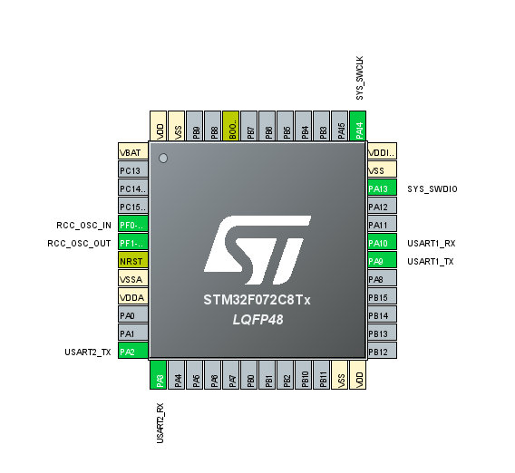

# STM32F072 DMA UART Rx Example

Target MCU : STM32F072C8

CubeMX IDE Version : 1.3.0

Modified file : main.c

Other files are code generated automatically by CubeMX.

## PinMap

DMA UART Pin : PA2(U2 Tx), PA3(U2 Rx)

Debug Pin (for printf):  PA10(U1 Rx), PA9(U1 Tx)

### Blog link

https://blog.naver.com/chandong83/222036416616